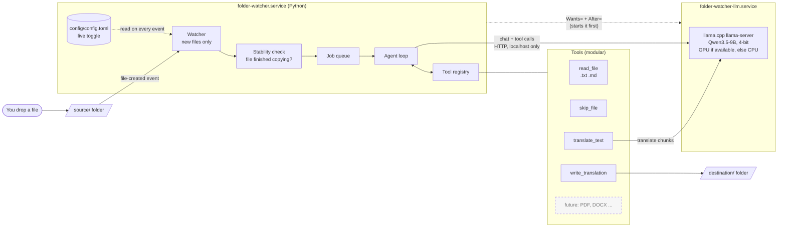
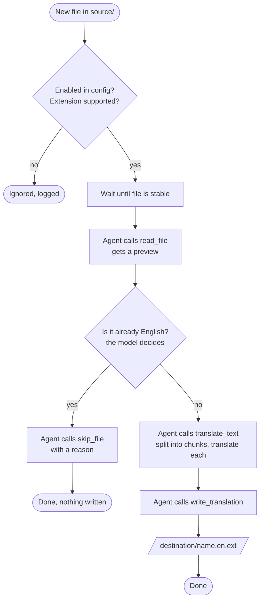

# Folder Watcher: an on-prem AI agent

Drop a document into a folder. A small AI agent, running **entirely on your own machine** with an open-weight model, notices it, decides what to do, and (if the document is not in English) writes an English translation to another folder. No cloud, no API keys, no data leaving your computer.

> **Status: built and in use.** The model server, the agent, the watcher and the two services all work; see [Using it](#using-it). Not yet done: the final acceptance checklist from `SPEC.md`, including a CPU-only test run. The full design is in [`SPEC.md`](SPEC.md).

---

## What it does

1. A service watches `source/`.
2. A **new** file arrives (files already there at start-up are ignored).
3. The agent reads the file and decides:
   - already English: **skip it**, and log why
   - not English: **translate** it and write `destination/<name>.en.<ext>`
4. You can switch watching on or off at any time by editing one config file. No restart needed.

Version 1 handles `.txt` and `.md`. The design is modular, so other formats (DOCX, PDF) are added later as extra tools.

## The agent, at a glance

### Components



### What the agent decides for each file



**Who decides what:** the *model* decides which tool to call. Ordinary *code* enforces the rules: it can only write inside `destination/`, only registered tools exist, and there is a hard step limit. That split (the model decides, the code guards) is the core idea of the lesson.

### Two services, started by hand

| Service | What it runs | Notes |
|---|---|---|
| `folder-watcher-llm` | the local model server (llama.cpp) | Loads the model into GPU memory. Slow to start, heavy. |
| `folder-watcher` | the Python watcher and agent | Starting it starts the model server first (`Wants=` + `After=`). If the model server restarts, the watcher keeps running and waits for it. |

Neither starts at boot or login. You start them when you want them.

---

## Requirements

- Windows 10 or 11 with **WSL2** and an **Ubuntu** distribution
- (Optional, recommended) an NVIDIA GPU with the **NVIDIA driver installed on Windows**. Without a GPU it still works on CPU, only slower.
- About **6 GB of free disk space** for the project (measured: model 5.3 GiB, llama.cpp build about 0.5 GB, Python environment about 0.1 GB), **plus about 5 GB** for the CUDA toolkit if you have an NVIDIA GPU.
- A **Claude** account that includes Claude Code (Pro, Max, Team, Enterprise, or Console), because Claude Code does the building
- A GitHub account

Model used: **Qwen3.5-9B**, 4-bit (`Q4_K_M`, about 5.7 GB), from [unsloth/Qwen3.5-9B-GGUF](https://hf.co/unsloth/Qwen3.5-9B-GGUF). Apache-2.0 licence, no login needed.

Not enough memory for it? See [Using a smaller model](#using-a-smaller-model).

---

## Setup, from a clean machine

Do the steps in order. Everything marked **PowerShell** runs in Windows PowerShell. Everything else runs in your **Ubuntu (WSL) terminal**.

### Step 1: WSL2 and Ubuntu (Windows side)

If you do not have WSL yet, in **PowerShell**:

```powershell
wsl --install
```

Reboot if Windows asks you to. Then check it is version 2 and your Ubuntu is listed:

```powershell
wsl --list --verbose
wsl --version
```

If `wsl --version` is not recognised, your WSL is an old built-in version. Update it from the Microsoft Store ([aka.ms/wslstorepage](https://aka.ms/wslstorepage)).

Open the **Ubuntu** app from the Start menu. From here on, commands run in that terminal.

### Step 2: NVIDIA driver (only if you have an NVIDIA GPU)

Install or update the normal **NVIDIA driver on Windows**. Then, inside Ubuntu, check the GPU is visible:

```bash
nvidia-smi
```

You should see your GPU in a table. **Do not install any NVIDIA driver inside WSL.** The Windows driver is shared with WSL automatically, and installing a Linux driver there can break it.

No GPU or no output? Carry on. The project falls back to CPU.

### Step 3: Turn on systemd in WSL

The two services run under systemd. First check whether it is already on:

```bash
ps -p 1 -o comm=
```

- It prints `systemd`: it is already on. Skip to Step 4.
- It prints `init` or something else: turn it on.

```bash
sudo tee /etc/wsl.conf > /dev/null <<'EOF'
[boot]
systemd=true
EOF
```

> If you already have a `/etc/wsl.conf` with other settings, do not overwrite it. Open it with `sudo nano /etc/wsl.conf` and add the two `[boot]` lines instead.

Now restart WSL. This is the **one** time you need to restart. In **PowerShell**:

```powershell
wsl.exe --shutdown
```

Then open the Ubuntu app again and confirm:

```bash
ps -p 1 -o comm=
```

It should now print `systemd`. (Microsoft documents the `[boot]` setting for Windows 11 and Windows Server 2022.)

### Step 4: Basic tools

```bash
sudo apt update
sudo apt install -y curl git wget
```

### Step 5: GitHub CLI (`gh`) and sign in

Install it (this is GitHub's official method for Debian and Ubuntu):

```bash
(type -p wget >/dev/null || (sudo apt update && sudo apt install wget -y)) \
	&& sudo mkdir -p -m 755 /etc/apt/keyrings \
	&& out=$(mktemp) && wget -nv -O$out https://cli.github.com/packages/githubcli-archive-keyring.gpg \
	&& cat $out | sudo tee /etc/apt/keyrings/githubcli-archive-keyring.gpg > /dev/null \
	&& sudo chmod go+r /etc/apt/keyrings/githubcli-archive-keyring.gpg \
	&& sudo mkdir -p -m 755 /etc/apt/sources.list.d \
	&& echo "deb [arch=$(dpkg --print-architecture) signed-by=/etc/apt/keyrings/githubcli-archive-keyring.gpg] https://cli.github.com/packages stable main" | sudo tee /etc/apt/sources.list.d/github-cli.list > /dev/null \
	&& sudo apt update \
	&& sudo apt install gh -y
```

Check it:

```bash
gh --version
```

Sign in. Choose **GitHub.com**, then **HTTPS**, then **Login with a web browser**, and follow the prompts:

```bash
gh auth login
```

Let git use that sign-in, and confirm it worked:

```bash
gh auth setup-git
gh auth status
```

Tell git who you are (use your own name and the email on your GitHub account):

```bash
git config --global user.name "Your Name"
git config --global user.email "you@example.com"
```

### Step 6: Install Claude Code

Use the official native installer:

```bash
curl -fsSL https://claude.ai/install.sh | bash
```

The installer puts `claude` in `~/.local/bin`. Make that folder available **right now**, in this same terminal (no need to close it), and make it permanent:

```bash
export PATH="$HOME/.local/bin:$PATH"
grep -qxF 'export PATH="$HOME/.local/bin:$PATH"' ~/.bashrc || echo 'export PATH="$HOME/.local/bin:$PATH"' >> ~/.bashrc
```

Check it:

```bash
claude --version
claude doctor
```

`claude --version` should print a version number. `claude doctor` prints a health check of the installation.

If `claude --version` says "command not found", run `ls -la ~/.local/bin/claude`. If that file exists, the `export` line above did not run in this terminal, so run it again. If the file does not exist, the install did not finish: re-run the installer and read its output.

Install and run Claude Code **inside Ubuntu (WSL)**, not from PowerShell.

Sign in the first time you start it (next step). It opens a browser page to log in. If no browser opens, copy the link it shows into a browser on Windows.

### Step 7: Get the project

If you do not have a `~/projects/folder_watcher` folder yet:

```bash
mkdir -p ~/projects
gh repo clone frozenfussion/folder_watcher ~/projects/folder_watcher
cd ~/projects/folder_watcher
```

If you **already** made the folder (for example with empty `source` and `destination` folders inside), connect it to the repository instead:

```bash
cd ~/projects/folder_watcher
git init -b main
git remote add origin https://github.com/frozenfussion/folder_watcher.git
git pull origin main
```

Check you can see the plan files:

```bash
ls
```

You should see `CLAUDE.md`, `SPEC.md`, and `README.md`.

> Keep the project inside your Linux home folder (`~/projects/...`), **not** under `/mnt/c/...`. File-change detection does not work reliably on Windows drives from WSL.

### Step 8: Let Claude Code build it

Start Claude Code in the project folder:

```bash
claude
```

Log in when asked. It reads `CLAUDE.md` automatically. Then paste this prompt:

```text
Read CLAUDE.md and SPEC.md completely, then build the Folder Watcher exactly as
specified. Follow the build order in CLAUDE.md and check in with me after each
milestone. Detect whether this machine has an NVIDIA GPU and build for GPU or
CPU accordingly. When something needs sudo, write a script in scripts/system/
and tell me the exact command to run. Do not guess flags or package names:
verify them first.
```

What to expect while it builds:

- Claude Code will ask permission before running commands. Read each one before you approve.
- When it needs administrator rights, it **cannot** type your password. It writes a script and tells you the command to run, such as `sudo bash scripts/system/01_base_packages.sh`. Run it in a **second** terminal tab (or exit Claude Code, run it, then restart `claude`), then tell Claude Code it is done.
- Building llama.cpp with GPU support and downloading the model take a while. That is normal.

---

## Testing it

These tests look inside each part by hand: the Python package, the config file, the llama.cpp build, the downloaded model, the local model server, the agent with its tools, and the folder watcher running in a terminal. For everyday use with the services, see [Using it](#using-it). Every command below was run on the reference machine (RTX 3070 Ti Laptop GPU, 8 GB) exactly as written.

The model is a language model, so its wording changes from run to run. The steps below tell you what to **check**. Real output is shown only as an *example*.

### Part A: checks that do not need the model server

**A1. Go to the project folder.**

```bash
cd ~/projects/folder_watcher
```

**A2. Run the unit tests.** They test the config loader, the model-server command line, the path guards, chunking, code protection, the tool registry, and the agent loop (with a fake model). They also test the watcher and the job queue on temporary folders. They need no model server and take about 20 seconds.

```bash
.venv/bin/pytest -q
```

What you should see: a final line like `108 passed`, and no `failed`.

**A3. Check which backend llama.cpp was built for.**

```bash
cat vendor/BACKEND
```

What you should see: `cuda` on a machine with an NVIDIA GPU, `cpu` otherwise.

**A4. Check the model file is there and complete.**

```bash
ls -l models/
```

What you should see: `Qwen3.5-9B-Q4_K_M.gguf` with a size of exactly `5680522464` bytes.

**A5. Read a value from the config file.**

```bash
.venv/bin/python -m folder_watcher config get watch.enabled
```

What you should see: `True`.

**A6. (GPU only) Note how much GPU memory is in use before the model loads.**

```bash
nvidia-smi --query-gpu=memory.used,memory.total --format=csv
```

What you should see: a small "used" number. Write it down; you compare against it later. Example:

```text
memory.used [MiB], memory.total [MiB]
791 MiB, 8192 MiB
```

### Part B: the local model server

You need **two terminal tabs**. Terminal 1 runs the model server. Terminal 2 sends it requests.

**B0. Make sure the services are not running**, because they would hold port 8080 (this is harmless if they are already stopped):

```bash
scripts/stop.sh
```

What you should see: `Both services are inactive.`

**B1. Terminal 1: go to the project folder.**

```bash
cd ~/projects/folder_watcher
```

**B2. Terminal 1: start the model server.** It reads `config/config.toml`, builds the `llama-server` command, and runs it in this terminal.

```bash
.venv/bin/python -m folder_watcher llm-server
```

What you should see: the first line starts with `backend=cuda exec:` (or `backend=cpu`) followed by the full command. Look for `--host 127.0.0.1`: the server is only reachable from this machine. After a few seconds the last lines include `model loaded` and `listening on http://127.0.0.1:8080`. **Leave it running.**

**B3. Terminal 2: go to the project folder.**

```bash
cd ~/projects/folder_watcher
```

**B4. Terminal 2: ask the server if it is ready.**

```bash
curl -s http://127.0.0.1:8080/health
```

What you should see: `{"status":"ok"}`. If you see `"Loading model"` with code `503` instead, the model is still loading: wait a few seconds and run it again.

**B5. (GPU only) Check the model is in GPU memory.**

```bash
nvidia-smi --query-gpu=memory.used,memory.total --format=csv
```

What you should see: "used" is about **5.5 GB higher** than the number you wrote down in A6. Example: `6251 MiB, 8192 MiB`.

**B6. Ask the model a question.**

```bash
curl -s http://127.0.0.1:8080/v1/chat/completions -H "Content-Type: application/json" -d '{"messages":[{"role":"user","content":"In one sentence, what is the capital of Malaysia?"}],"max_tokens":100}' | python3 -c 'import sys,json; m=json.load(sys.stdin)["choices"][0]["message"]; print("Answer:", m["content"]); print("Thinking text present:", "<think>" in m["content"] or bool(m.get("reasoning_content")))'
```

What you should check: the answer mentions **Kuala Lumpur**, and `Thinking text present: False`. (Qwen3.5 "thinks" out loud by default; the server is started with thinking turned off, because it wastes time on translation.) Example:

```text
Answer: The capital of Malaysia is Kuala Lumpur.
Thinking text present: False
```

**B7. Check the model can call a tool.** The agent depends on this. The request offers the model one made-up tool, `get_weather`.

```bash
curl -s http://127.0.0.1:8080/v1/chat/completions -H "Content-Type: application/json" -d '{"messages":[{"role":"user","content":"What is the weather in Penang?"}],"tools":[{"type":"function","function":{"name":"get_weather","description":"Get the current weather for a city.","parameters":{"type":"object","properties":{"city":{"type":"string"}},"required":["city"]}}}],"max_tokens":200}' | python3 -c 'import sys,json; c=json.load(sys.stdin)["choices"][0]; print("finish_reason:", c["finish_reason"]); [print("tool call:", t["function"]["name"], t["function"]["arguments"]) for t in c["message"].get("tool_calls") or []]'
```

What you should check: `finish_reason: tool_calls`, and a tool call to `get_weather` with the city `Penang`. Example:

```text
finish_reason: tool_calls
tool call: get_weather {"city":"Penang"}
```

### Part C: the agent, on one file at a time

Here you hand the agent one file yourself with the `run` command, without the watcher (Part E shows the watcher). The agent only reads files inside `source/`, so each test first copies a sample file there. Keep the model server running in Terminal 1 and type these in **Terminal 2**.

#### Test A: an English note is skipped

**C1. Copy the English sample into `source/`.**

```bash
cp tests/samples/english_note.txt source/
```

**C2. Run the agent on it.**

```bash
.venv/bin/python -m folder_watcher run source/english_note.txt
```

What you should check: the agent calls `read_file`, then `skip_file` with a reason, and the last line starts with `SKIPPED` followed by that reason. The model chooses the reason, so its wording varies. The document text itself is not printed (it is only shown at DEBUG level). Example:

```text
11:44:02 INFO    [job 2ece] new file source/english_note.txt
11:44:03 INFO    [job 2ece] step 1 -> tool read_file {"path":"source/english_note.txt"}
11:44:03 INFO    [job 2ece] step 1 <- {"text_preview": "<171 chars, shown at DEBUG>", "total_chars": 171, "format": ".txt"}
11:44:04 INFO    [job 2ece] step 2 -> tool skip_file {"reason":"Document is already in English"}
11:44:04 INFO    [job 2ece] step 2 <- {"status": "skipped"}
11:44:04 INFO    [job 2ece] SKIPPED in 2.4s: Document is already in English
```

**C3. Check nothing was written.**

```bash
ls destination/
```

What you should see: no `english_note` file. (An empty listing is correct.)

#### Test B: a Malay report is translated

**C4. Copy the Malay sample into `source/`.**

```bash
cp tests/samples/laporan_mingguan.md source/
```

**C5. Run the agent on it.**

```bash
.venv/bin/python -m folder_watcher run source/laporan_mingguan.md
```

What you should check: three tool calls, `read_file`, then `translate_text`, then `write_translation`, and a last line starting with `DONE` that names `destination/laporan_mingguan.en.md`. It takes a few seconds. Example:

```text
11:44:20 INFO    [job 3399] step 1 -> tool read_file {"path":"source/laporan_mingguan.md"}
11:44:20 INFO    [job 3399] step 1 <- {"text_preview": "<812 chars, shown at DEBUG>", "total_chars": 812, "format": ".md"}
11:44:21 INFO    [job 3399] step 2 -> tool translate_text {"source_language":"Malay"}
11:44:25 INFO    [job 3399] chunk 1/1 translated in 3.3s
11:44:25 INFO    [job 3399] step 2 <- {"translation_id": "t1", "chunks": 1, "protected_items": 2}
11:44:26 INFO    [job 3399] step 3 -> tool write_translation {"translation_id":"t1"}
11:44:26 INFO    [job 3399] step 3 <- {"status": "written", "path": "destination/laporan_mingguan.en.md"}
11:44:26 INFO    [job 3399] DONE in 7.1s: wrote destination/laporan_mingguan.en.md
```

`protected_items: 2` means the code block and the link were swapped out for placeholders before the text went to the model, and put back afterwards. The model never sees them, so it cannot change them.

**C6. Read the translation.**

```bash
cat destination/laporan_mingguan.en.md
```

What you should check: it is in English, with the same headings, lists and code block as the original.

**C7. Check the code block is byte-for-byte unchanged.** This extracts the code block from both files and compares them. The Malay comment inside it must still be in Malay.

```bash
diff <(sed -n '/^```/,/^```/p' tests/samples/laporan_mingguan.md) <(sed -n '/^```/,/^```/p' destination/laporan_mingguan.en.md) && echo "Code block unchanged"
```

What you should see: `Code block unchanged`.

**C8. Check the link is unchanged.**

```bash
grep -oF 'https://example.com/projek' destination/laporan_mingguan.en.md
```

What you should see: `https://example.com/projek`.

**C9. Check the Markdown structure survived.** This compares the headings, list markers and code fences of the original and the translation, line by line.

```bash
diff <(grep -oE '^(#+|-|[0-9]+\.|```)' tests/samples/laporan_mingguan.md) <(grep -oE '^(#+|-|[0-9]+\.|```)' destination/laporan_mingguan.en.md) && echo "Structure matches"
```

What you should see: `Structure matches`.

#### More tests (optional)

**C10. A French `.txt` file.**

```bash
cp tests/samples/rapport_fr.txt source/
```

```bash
.venv/bin/python -m folder_watcher run source/rapport_fr.txt
```

What you should check: `DONE`, and a new file `destination/rapport_fr.en.txt` in English.

**C11. A long document that needs several chunks.** `long_rapport.md` (about 7,400 characters) is split into 3 chunks, translated one by one, and joined back in order. This takes about half a minute.

```bash
cp tests/samples/long_rapport.md source/
```

```bash
.venv/bin/python -m folder_watcher run source/long_rapport.md
```

What you should check: three lines `chunk 1/3`, `chunk 2/3`, `chunk 3/3`, then `DONE`. Then check that all 12 sections came back, in order, once each:

```bash
grep -c '^## Section' destination/long_rapport.en.md
```

What you should see: `12`.

**C12. An empty file** is skipped without asking the model. (The `cat` command below creates an empty file.)

```bash
cat > source/vide.txt <<'EOF'
EOF
```

```bash
.venv/bin/python -m folder_watcher run source/vide.txt
```

What you should see: `SKIPPED in 0.0s: empty file (no model call)`.

**C13. The step limit.** `--max-steps 1` allows only one model turn, which is not enough to finish, so the job must fail cleanly and write nothing.

```bash
.venv/bin/python -m folder_watcher run source/rapport_fr.txt --max-steps 1
```

What you should see: `FAILED ... step limit of 1 reached without skip_file or write_translation`.

**C14. A path escape.** The agent refuses any file outside `source/`, even through `..`.

```bash
.venv/bin/python -m folder_watcher run source/../tests/samples/english_note.txt
```

What you should see: `refused: ... is not inside the source folder ...`. No model call is made.

> Running the same test twice never overwrites anything: the second output gets a number, for example `laporan_mingguan.en-1.md`.

### Part E: the watcher

The watcher notices new files in `source/` by itself and hands each one to the agent. You need a **third terminal tab** now:

- Terminal 1: the model server (still running from B2).
- Terminal 2: the watcher.
- Terminal 3: where you drop files and change settings.

**E1. Terminal 2: empty `source/` and `destination/` first.** This removes the test files from Part C, so the watcher starts with an empty `source/`.

```bash
rm -f source/english_note.txt source/laporan_mingguan.md source/rapport_fr.txt source/long_rapport.md source/vide.txt destination/laporan_mingguan.en*.md destination/rapport_fr.en*.txt destination/long_rapport.en*.md
```

What you should see: nothing.

**E2. Terminal 2: start the watcher.** It runs in this terminal until you press Ctrl+C.

```bash
.venv/bin/python -m folder_watcher watch
```

What you should see: `model server is ready`, then a line starting `watching .../source for new .txt, .md files; watching is enabled. 0 file(s) already there are ignored.` Leave it running.

**E3. Terminal 3: go to the project folder.**

```bash
cd ~/projects/folder_watcher
```

#### Watcher test 1: a new Malay document is translated

**E4. Terminal 3: drop the Malay report into `source/`.** A plain `cp` is all it takes. Your own Bahasa Malaysia `.txt` files work the same way.

```bash
cp tests/samples/laporan_mingguan.md source/
```

What you should see **in Terminal 2**: `new file laporan_mingguan.md (created); waiting until it stops changing`, then about 2 seconds later `queued laporan_mingguan.md`, then the agent's steps, and finally `DONE ... wrote destination/laporan_mingguan.en.md`. The 2 seconds are `stable_seconds` in the config: the watcher waits until the file has stopped changing, so it never reads a half-copied file. From drop to done took about 9 seconds on the reference machine.

**E5. Terminal 3: check the translation arrived.**

```bash
ls destination/
```

What you should see: `laporan_mingguan.en.md`.

#### Watcher test 2: an English note is skipped

**E6. Terminal 3: drop the English note.**

```bash
cp tests/samples/english_note.txt source/
```

What you should see **in Terminal 2**: the agent calls `read_file`, then `skip_file`, and the job ends with `SKIPPED in ...s:` followed by the agent's reason, for example `Document is already in English`.

**E7. Terminal 3: check nothing new was written.**

```bash
ls destination/
```

What you should see: still only `laporan_mingguan.en.md`.

#### Watcher test 3: switch watching off and on, without a restart

**E8. Terminal 3: switch watching off.** This edits `watch.enabled` in `config/config.toml`. The watcher re-reads the file every second.

```bash
.venv/bin/python -m folder_watcher config set watch.enabled false
```

What you should see: `watch.enabled: True -> False`. **In Terminal 2**, within a second: `watching disabled`.

**E9. Terminal 3: drop a file while watching is off.**

```bash
cat > source/semasa_tutup.txt <<'EOF'
Fail ini dihantar semasa pemantauan dimatikan. Ia tidak sepatutnya diterjemahkan.
EOF
```

What you should see **in Terminal 2**: `ignored semasa_tutup.txt: watching is disabled (it will not be processed later)`.

**E10. Terminal 3: switch watching back on.**

```bash
.venv/bin/python -m folder_watcher config set watch.enabled true
```

What you should see: `watch.enabled: False -> True`. **In Terminal 2**: `watching enabled`, and **nothing else**. The file from E9 is not picked up now: files that arrive while watching is off are ignored for good.

**E11. Terminal 3: confirm the file from E9 was not translated.**

```bash
ls destination/
```

What you should see: still only `laporan_mingguan.en.md`. There is no `semasa_tutup.en.txt`.

**E12. Terminal 3: drop a new file now that watching is on.**

```bash
cat > source/selepas_buka.txt <<'EOF'
Fail ini dihantar selepas pemantauan dihidupkan semula. Ia sepatutnya diterjemahkan.
EOF
```

What you should see **in Terminal 2**: the agent translates it and ends with `DONE ... wrote destination/selepas_buka.en.txt`.

#### Watcher test 4: files already in `source/` are ignored

**E13. Terminal 2: stop the watcher.** Press **Ctrl+C** in Terminal 2.

What you should see: `stopping (SIGINT): no new files will be taken`, then `watcher stopped`. The model server in Terminal 1 keeps running.

**E14. Terminal 2: start the watcher again.** `source/` now holds four files from the tests above.

```bash
.venv/bin/python -m folder_watcher watch
```

What you should see: `... 4 file(s) already there are ignored.` and then nothing more. None of the four files is processed again.

**E15. Terminal 3: confirm nothing new was written.** Wait a few seconds first.

```bash
ls destination/
```

What you should see: the same two files as before, `laporan_mingguan.en.md` and `selepas_buka.en.txt`.

**E16. Terminal 2: stop the watcher.** Press **Ctrl+C** in Terminal 2.

> If you stop the watcher while it is in the middle of a job, that job is **abandoned** at the next safe point (between two model calls) and nothing is written for it; the log says `ABANDONED` and names the file. Copy the file into `source/` again later to process it. If the model server stops while the watcher runs, the job is **not** lost: the log says `stays queued, retrying in 5s` (then 10, 20, 40, 60 seconds) and the job runs as soon as the model server is back.

### Part D: clean up and stop

**D1. Terminal 3: remove the test files from `source/` and `destination/`.**

```bash
rm -f source/english_note.txt source/laporan_mingguan.md source/semasa_tutup.txt source/selepas_buka.txt destination/laporan_mingguan.en*.md destination/selepas_buka.en*.txt
```

What you should see: nothing. `ls source/ destination/` now shows both folders empty.

**D2. Terminal 1: stop the model server.** Press **Ctrl+C** in Terminal 1.

What you should see: a line ending in `cleaning up before exit...`, then your normal prompt.

**D3. Terminal 3: check the server is gone.**

```bash
curl -s http://127.0.0.1:8080/health
```

What you should see: nothing at all. `curl` cannot connect any more.

**D4. (GPU only) Check the GPU memory was freed.**

```bash
nvidia-smi --query-gpu=memory.used,memory.total --format=csv
```

What you should see: about the same "used" number as in A6. Example: `786 MiB, 8192 MiB`.

### Optional: see the GPU offload in the server log

The normal server log does not list where each layer went. To see it, start the server in Terminal 1 with more detailed logging, filtered down to the two lines that matter:

```bash
LLAMA_ARG_LOG_VERBOSITY=4 .venv/bin/python -m folder_watcher llm-server 2>&1 | grep --line-buffered -E "offloaded|listening"
```

What you should see (on a GPU machine):

```text
0.01.344.840 I load_tensors: offloaded 33/33 layers to GPU
0.02.285.892 I srv  llama_server: listening on http://127.0.0.1:8080
```

`33/33` means the whole model is on the GPU. Press **Ctrl+C** to stop it.

### Not testable yet

| Feature | Available after |
|---|---|
| CPU-only mode (`gpu_layers = "0"`) and the full acceptance checklist | Milestone 7 |

---

## Using it

### Controlling the services

Run these in the project folder (`cd ~/projects/folder_watcher`).

| Do this | Command | What you should see |
|---|---|---|
| Start | `scripts/start.sh` | `READY after ...s: you can drop files into .../source/ now.` |
| Stop | `scripts/stop.sh` | Both services `inactive`, GPU memory freed, `Stopped in ...s.` |
| Restart | `scripts/restart.sh` | The stop lines, then `READY after ...s`. |
| Status | `scripts/status.sh` | Both services `active` or `inactive`, model health, GPU memory, `watch.enabled`, and `All checks passed.` |
| Logs | `scripts/logs.sh` | The agent's steps as files arrive; **Ctrl+C** stops following (the services keep running). |
| Watching off | `.venv/bin/python -m folder_watcher config set watch.enabled false` | `watch.enabled: True -> False`; files arriving now are ignored for good. |
| Watching on | `.venv/bin/python -m folder_watcher config set watch.enabled true` | `watch.enabled: False -> True`; new files are processed again. No restart needed. |

**The services never start on their own.** After you close WSL or reboot Windows, run `scripts/start.sh` again.

Day to day, the model server and the watcher run as two **systemd user services**. They **never start by themselves** (not at boot, not at login): you start them with `scripts/start.sh` and stop them with `scripts/stop.sh`. Every command below was run on the reference machine exactly as written.

### Once: install the services

```bash
cd ~/projects/folder_watcher
```

```bash
scripts/install_services.sh
```

What you should see: `wrote .../folder-watcher-llm.service` and `wrote .../folder-watcher.service` the first time (`unchanged` on later runs), then `is-enabled: static` for both. **`static` means the service has no `[Install]` section, so it cannot be enabled to start automatically.** That is on purpose.

### Start

```bash
scripts/start.sh
```

What you should see: `Starting the model server, then the watcher ...` and, when everything is up, `READY after 4.3s: you can drop files into .../source/ now.` The command only returns once the watcher is really watching. **Wait for `READY` before dropping files**: files that are already in `source/` when the watcher starts are ignored on purpose. Right after a reboot the first start is slower, because the 5.7 GB model is read from disk.

### Watch the agent work

Open a **second terminal tab** for the log:

```bash
cd ~/projects/folder_watcher
```

```bash
scripts/logs.sh
```

What you should see: the watcher's lines (`watching ... for new .txt, .md files`) and the important model-server lines, including `offloaded 33/33 layers to GPU` on a GPU machine. It keeps following the log; **Ctrl+C** stops following, not the services. `scripts/logs.sh all` shows everything the model server prints (much more).

### Drop a file

Back in the **first tab**:

```bash
cp tests/samples/laporan_mingguan.md source/
```

What you should see **in the log tab**: `new file laporan_mingguan.md`, `queued`, the agent's tool calls, and `DONE in ...s: wrote destination/laporan_mingguan.en.md`, about 10 seconds after the drop.

```bash
ls destination/
```

What you should see: `laporan_mingguan.en.md`. Your own `.txt` and `.md` files work the same way: copy them into `source/`.

> Copying a file over one **with the same name** that is already in `source/` is an *edit*, not a new arrival, so it is not processed. Delete the old copy first (`rm source/<name>`) or give the file a new name.

### Switch watching off and on (no restart)

```bash
.venv/bin/python -m folder_watcher config set watch.enabled false
```

What you should see: `watch.enabled: True -> False`, and **in the log tab** `watching disabled` within a second. Files that arrive while watching is off are **ignored for good**: they are not processed when you switch it back on.

```bash
.venv/bin/python -m folder_watcher config set watch.enabled true
```

What you should see: `watch.enabled: False -> True`, and **in the log tab** `watching enabled`.

### Status

```bash
scripts/status.sh
```

What you should see: both services `active (static)` with their start time, `llama.cpp backend: cuda`, `Model server (port 8080): {"status":"ok"}`, the GPU memory in use, the live config (`watch.enabled = True`), and a preflight check ending in `All checks passed.`

### Stop

```bash
scripts/stop.sh
```

What you should see: both services `inactive`, the GPU memory before and after (for example `6387 MiB before, 922 MiB now (freed 5465 MiB)`), and `Stopped in 0.3s. Both services are inactive.`

If you stop the services while a file is being translated, that file is not finished and nothing is written for it; the log says `not processed: <file> (copy it into source/ again to process it)`.

### The restart test: nothing starts by itself

This proves the services do not start on their own after WSL restarts. (Claude Code cannot do this step for you: shutting down WSL would end its own session.)

**R1.** Make sure the services are stopped (they are, after `scripts/stop.sh` above). Then, in **Windows PowerShell** (not in Ubuntu):

```powershell
wsl.exe --shutdown
```

What you should see: nothing; the Ubuntu window(s) close or show that the process exited.

**R2.** Open the **Ubuntu** app again, then:

```bash
cd ~/projects/folder_watcher
```

```bash
scripts/status.sh
```

What you should see: both services `inactive (static)`, `Model server (port 8080): not answering`, and the GPU memory back at its idle level. They did **not** start by themselves.

**R3.** Start them by hand and check they work again:

```bash
scripts/start.sh
```

What you should see: `READY after ...s`. This first start after a WSL restart reads the model from disk, so it may take longer than the usual few seconds. Then stop them again:

```bash
scripts/stop.sh
```

### Preflight check

```bash
.venv/bin/python -m folder_watcher check
```

It checks the config, the folders, the model file, the llama.cpp build, the GPU, systemd and the services, and prints a plain-language **fix** for every problem it finds. It exits with an error if anything is wrong.

---

## Using a smaller model

If the 9B model does not fit your GPU memory, use the 4B version from the same family:

| Model | File | Size |
|---|---|---|
| Qwen3.5-9B (default) | `Qwen3.5-9B-Q4_K_M.gguf` | about 5.7 GB |
| **Qwen3.5-4B** | `Qwen3.5-4B-Q4_K_M.gguf` | about 2.7 GB |

Repository: [unsloth/Qwen3.5-4B-GGUF](https://hf.co/unsloth/Qwen3.5-4B-GGUF). A rough rule: the model file plus another one to two gigabytes for working memory should fit in your free GPU memory (check with `nvidia-smi`). If it does not, the server can place some layers on the CPU. That works but is slower.

To switch, ask Claude Code:

```text
Switch the project to Qwen3.5-4B Q4_K_M from unsloth/Qwen3.5-4B-GGUF.
Download it into models/, update model_path and alias in config/config.toml,
restart the services, and confirm it works by translating a sample file.
```

The config change it will make is only this (in `config/config.toml`):

```toml
[llm]
model_path = "models/Qwen3.5-4B-Q4_K_M.gguf"
alias = "qwen3.5-4b"
```

Smaller models translate less accurately and follow tool instructions less reliably, so expect to test the results.

**No GPU at all?** Everything is designed to run on the CPU too: `scripts/build_llama.sh` detects a missing GPU and builds for CPU, and `gpu_layers = "0"` in `[llm]` is meant to force CPU use even when a GPU is present. *CPU mode has not been tested yet; that is part of the final acceptance checks.* A smaller model is the better choice on CPU.

---

## Extending: adding a new file type (design preview)

Each file type is a **reader tool** plus a config entry. For example, to add Word files later:

1. Add a module `tools/readers_docx.py` that provides a `read_docx` tool for `.docx`.
2. Add the library it needs as an optional dependency.
3. Add `".docx"` to `extensions` in `[watch]`.

The agent loop does not change. The agent is only shown the tools that fit the file in front of it.

---

## Project files

| File | Purpose |
|---|---|
| [`SPEC.md`](SPEC.md) | The complete design and acceptance checklist |
| [`CLAUDE.md`](CLAUDE.md) | Working rules for Claude Code |
| `config/config.toml` | The one config file |
| `source/` | Watched folder: drop files here |
| `destination/` | Translated files appear here |
| `scripts/` | `start.sh`, `stop.sh`, `status.sh`, `logs.sh`, `install_services.sh`, and the setup scripts |
| `state/` | The processed-file ledger (git-ignored) |

## Troubleshooting

| Symptom | Fix |
|---|---|
| `claude: command not found` | Run `export PATH="$HOME/.local/bin:$PATH"` in the current terminal, then check again. |
| `ps -p 1 -o comm=` does not print `systemd` after the restart | Check `/etc/wsl.conf` has the two `[boot]` lines, then run `wsl.exe --shutdown` in PowerShell again. Make sure WSL is up to date (`wsl --version`). |
| `nvidia-smi` not found or shows no GPU in Ubuntu | Update the NVIDIA driver on **Windows** and update WSL. Do not install a driver inside Ubuntu. |
| `gh auth status` says you are not logged in | Run `gh auth login` again. |
| `git pull` or `git push` asks for a password | Run `gh auth setup-git`, then try again. |
| `E: Unable to locate package` | Run `sudo apt update` first. |
| `Failed to connect to bus: No medium found` from `systemctl --user` or the scripts | Run `export XDG_RUNTIME_DIR=/run/user/$(id -u)` and add that line to `~/.bashrc`. `scripts/status.sh` and `check` detect this and print the same fix. |
| `start.sh` says `the services did not start` and the log shows `model not found at .../models/...gguf` | Run `scripts/download_model.sh`, then `scripts/start.sh` again. (`start.sh` has already stopped both services again.) |
| `Warning: The unit file ... changed on disk. Run 'systemctl --user daemon-reload'` | Run `scripts/install_services.sh` again; it rewrites the service files and reloads them. |
| A file was dropped but never processed, and the log says `not processed: <file>` or `ABANDONED` | The services were stopped or restarted while that file was waiting or being translated. Copy it into `source/` again. |
| The model server stopped on its own (crash or `systemctl --user kill`) | It restarts by itself within a few seconds. The watcher keeps running; files waiting at that moment are processed once the model is back (the log says `stays queued, retrying in ...`). |
| After the model server stops, the watcher needs about 20 seconds to notice | Expected with WSL's `networkingMode=mirrored`: a connection to a stopped server hangs instead of being refused, so the watcher waits for a 5-second timeout (three tries). |
| I copied a file into `source/` again and nothing happened | A file with that name was already there, so the copy was an edit, not a new arrival. Run `rm source/<name>` first, then copy it again. |
| A file dropped right after `start.sh`, before `READY`, was ignored | Wait for the `READY` line. Files present when the watcher starts count as "already there" and are never processed. |
| An NVIDIA Linux driver ended up installed inside WSL (for example via Ubuntu's `nvidia-cuda-toolkit`) | Run `sudo bash scripts/system/02_cuda_toolkit_wsl.sh`; it removes those packages and installs NVIDIA's WSL toolkit instead. |

*This README is updated as each milestone is finished. It currently reflects Milestones 1 to 6.*
