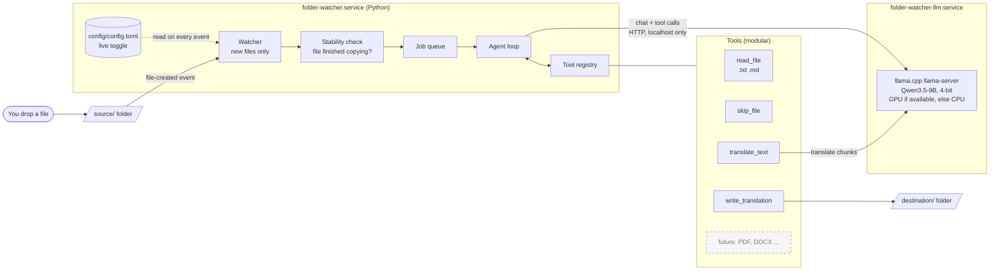

# Folder Watcher: an on-prem AI agent

Drop a document into a folder. A small AI agent, running **entirely on your own machine** with an open-weight model, notices it, decides what to do, and (if the document is not in English) writes an English translation to another folder. No cloud, no API keys, no data leaving your computer.

> **Status: planning stage.** This README describes the design and how to set up your machine. The "Using it" section describes the *planned* behaviour and will be updated after the build is finished. The full design is in [`SPEC.md`](SPEC.md).

---

## What it does

1. A service watches `source/`.
2. A **new** file arrives (files already there at start-up are ignored).
3. The agent reads the file and decides:
   - already English: **skip it**, and log why
   - not English: **translate** it and write `destination/<name>.en.<ext>`
4. You can switch watching on or off at any time by editing one config file. No restart needed.

Version 1 handles `.txt` and `.md`. The design is modular, so other formats (DOCX, PDF) are added later as extra tools.

## The agent, at a glance

### Components



### What the agent decides for each file


**Who decides what:** the *model* decides which tool to call. Ordinary *code* enforces the rules: it can only write inside `destination/`, only registered tools exist, and there is a hard step limit. That split (the model decides, the code guards) is the core idea of the lesson.

### Two services, started by hand

| Service | What it runs | Notes |
|---|---|---|
| `folder-watcher-llm` | the local model server (llama.cpp) | Loads the model into GPU memory. Slow to start, heavy. |
| `folder-watcher` | the Python watcher and agent | Starting it starts the model server first. |

Neither starts at boot or login. You start them when you want them.

---

## Requirements

- Windows 10 or 11 with **WSL2** and an **Ubuntu** distribution
- (Optional, recommended) an NVIDIA GPU with the **NVIDIA driver installed on Windows**. Without a GPU it still works on CPU, only slower.
- About **10 GB of free disk space** for the model, tools, and build. (Rough estimate. The 9B model file alone is about 5.7 GB.)
- A **Claude** account that includes Claude Code (Pro, Max, Team, Enterprise, or Console), because Claude Code does the building
- A GitHub account

Model used: **Qwen3.5-9B**, 4-bit (`Q4_K_M`, about 5.7 GB), from [unsloth/Qwen3.5-9B-GGUF](https://hf.co/unsloth/Qwen3.5-9B-GGUF). Apache-2.0 licence, no login needed.

Not enough memory for it? See [Using a smaller model](#using-a-smaller-model).

---

## Setup, from a clean machine

Do the steps in order. Everything marked **PowerShell** runs in Windows PowerShell. Everything else runs in your **Ubuntu (WSL) terminal**.

### Step 1: WSL2 and Ubuntu (Windows side)

If you do not have WSL yet, in **PowerShell**:

```powershell
wsl --install
```

Reboot if Windows asks you to. Then check it is version 2 and your Ubuntu is listed:

```powershell
wsl --list --verbose
wsl --version
```

If `wsl --version` is not recognised, your WSL is an old built-in version. Update it from the Microsoft Store ([aka.ms/wslstorepage](https://aka.ms/wslstorepage)).

Open the **Ubuntu** app from the Start menu. From here on, commands run in that terminal.

### Step 2: NVIDIA driver (only if you have an NVIDIA GPU)

Install or update the normal **NVIDIA driver on Windows**. Then, inside Ubuntu, check the GPU is visible:

```bash
nvidia-smi
```

You should see your GPU in a table. **Do not install any NVIDIA driver inside WSL.** The Windows driver is shared with WSL automatically, and installing a Linux driver there can break it.

No GPU or no output? Carry on. The project falls back to CPU.

### Step 3: Turn on systemd in WSL

The two services run under systemd. First check whether it is already on:

```bash
ps -p 1 -o comm=
```

- It prints `systemd`: it is already on. Skip to Step 4.
- It prints `init` or something else: turn it on.

```bash
sudo tee /etc/wsl.conf > /dev/null <<'EOF'
[boot]
systemd=true
EOF
```

> If you already have a `/etc/wsl.conf` with other settings, do not overwrite it. Open it with `sudo nano /etc/wsl.conf` and add the two `[boot]` lines instead.

Now restart WSL. This is the **one** time you need to restart. In **PowerShell**:

```powershell
wsl.exe --shutdown
```

Then open the Ubuntu app again and confirm:

```bash
ps -p 1 -o comm=
```

It should now print `systemd`. (Microsoft documents the `[boot]` setting for Windows 11 and Windows Server 2022.)

### Step 4: Basic tools

```bash
sudo apt update
sudo apt install -y curl git wget
```

### Step 5: GitHub CLI (`gh`) and sign in

Install it (this is GitHub's official method for Debian and Ubuntu):

```bash
(type -p wget >/dev/null || (sudo apt update && sudo apt install wget -y)) \
	&& sudo mkdir -p -m 755 /etc/apt/keyrings \
	&& out=$(mktemp) && wget -nv -O$out https://cli.github.com/packages/githubcli-archive-keyring.gpg \
	&& cat $out | sudo tee /etc/apt/keyrings/githubcli-archive-keyring.gpg > /dev/null \
	&& sudo chmod go+r /etc/apt/keyrings/githubcli-archive-keyring.gpg \
	&& sudo mkdir -p -m 755 /etc/apt/sources.list.d \
	&& echo "deb [arch=$(dpkg --print-architecture) signed-by=/etc/apt/keyrings/githubcli-archive-keyring.gpg] https://cli.github.com/packages stable main" | sudo tee /etc/apt/sources.list.d/github-cli.list > /dev/null \
	&& sudo apt update \
	&& sudo apt install gh -y
```

Check it:

```bash
gh --version
```

Sign in. Choose **GitHub.com**, then **HTTPS**, then **Login with a web browser**, and follow the prompts:

```bash
gh auth login
```

Let git use that sign-in, and confirm it worked:

```bash
gh auth setup-git
gh auth status
```

Tell git who you are (use your own name and the email on your GitHub account):

```bash
git config --global user.name "Your Name"
git config --global user.email "you@example.com"
```

### Step 6: Install Claude Code

Use the official native installer:

```bash
curl -fsSL https://claude.ai/install.sh | bash
```

The installer puts `claude` in `~/.local/bin`. Make that folder available **right now**, in this same terminal (no need to close it), and make it permanent:

```bash
export PATH="$HOME/.local/bin:$PATH"
grep -qxF 'export PATH="$HOME/.local/bin:$PATH"' ~/.bashrc || echo 'export PATH="$HOME/.local/bin:$PATH"' >> ~/.bashrc
```

Check it:

```bash
claude --version
claude doctor
```

`claude --version` should print a version number. `claude doctor` prints a health check of the installation.

If `claude --version` says "command not found", run `ls -la ~/.local/bin/claude`. If that file exists, the `export` line above did not run in this terminal, so run it again. If the file does not exist, the install did not finish: re-run the installer and read its output.

Install and run Claude Code **inside Ubuntu (WSL)**, not from PowerShell.

Sign in the first time you start it (next step). It opens a browser page to log in. If no browser opens, copy the link it shows into a browser on Windows.

### Step 7: Get the project

If you do not have a `~/projects/folder_watcher` folder yet:

```bash
mkdir -p ~/projects
gh repo clone frozenfussion/folder_watcher ~/projects/folder_watcher
cd ~/projects/folder_watcher
```

If you **already** made the folder (for example with empty `source` and `destination` folders inside), connect it to the repository instead:

```bash
cd ~/projects/folder_watcher
git init -b main
git remote add origin https://github.com/frozenfussion/folder_watcher.git
git pull origin main
```

Check you can see the plan files:

```bash
ls
```

You should see `CLAUDE.md`, `SPEC.md`, and `README.md`.

> Keep the project inside your Linux home folder (`~/projects/...`), **not** under `/mnt/c/...`. File-change detection does not work reliably on Windows drives from WSL.

### Step 8: Let Claude Code build it

Start Claude Code in the project folder:

```bash
claude
```

Log in when asked. It reads `CLAUDE.md` automatically. Then paste this prompt:

```text
Read CLAUDE.md and SPEC.md completely, then build the Folder Watcher exactly as
specified. Follow the build order in CLAUDE.md and check in with me after each
milestone. Detect whether this machine has an NVIDIA GPU and build for GPU or
CPU accordingly. When something needs sudo, write a script in scripts/system/
and tell me the exact command to run. Do not guess flags or package names:
verify them first.
```

What to expect while it builds:

- Claude Code will ask permission before running commands. Read each one before you approve.
- When it needs administrator rights, it **cannot** type your password. It writes a script and tells you the command to run, such as `sudo bash scripts/system/01_base_packages.sh`. Run it in a **second** terminal tab (or exit Claude Code, run it, then restart `claude`), then tell Claude Code it is done.
- Building llama.cpp with GPU support and downloading the model take a while. That is normal.

---

## Using it (planned)

> These commands are the **plan** from `SPEC.md`. They will be confirmed and corrected once the build is finished.

Start the services (this also loads the model, which can take a minute):

```bash
scripts/start.sh
```

Watch what the agent is doing:

```bash
scripts/logs.sh
```

Drop a file in `source/` (from another terminal tab):

```bash
cp my_french_note.txt source/
```

After a short wait, `destination/my_french_note.en.txt` appears. The log shows every step the agent took, including *why* it skipped or translated.

Switch watching off and on without restarting (`config/config.toml`, section `[watch]`):

```toml
[watch]
enabled = false      # change to true to resume
extensions = [".txt", ".md"]
```

> Files that arrive while watching is **off** are ignored for good. They are not processed when you switch it back on.

Check status, and stop when you are finished (this also frees the GPU memory):

```bash
scripts/status.sh
scripts/stop.sh
```

The services never start on their own. After you close WSL or reboot, run `scripts/start.sh` again.

---

## Using a smaller model

If the 9B model does not fit your GPU memory, use the 4B version from the same family:

| Model | File | Size |
|---|---|---|
| Qwen3.5-9B (default) | `Qwen3.5-9B-Q4_K_M.gguf` | about 5.7 GB |
| **Qwen3.5-4B** | `Qwen3.5-4B-Q4_K_M.gguf` | about 2.7 GB |

Repository: [unsloth/Qwen3.5-4B-GGUF](https://hf.co/unsloth/Qwen3.5-4B-GGUF). A rough rule: the model file plus another one to two gigabytes for working memory should fit in your free GPU memory (check with `nvidia-smi`). If it does not, the server can place some layers on the CPU. That works but is slower.

To switch, ask Claude Code:

```text
Switch the project to Qwen3.5-4B Q4_K_M from unsloth/Qwen3.5-4B-GGUF.
Download it into models/, update model_path and alias in config/config.toml,
restart the services, and confirm it works by translating a sample file.
```

The config change it will make is only this (in `config/config.toml`):

```toml
[llm]
model_path = "models/Qwen3.5-4B-Q4_K_M.gguf"
alias = "qwen3.5-4b"
```

Smaller models translate less accurately and follow tool instructions less reliably, so expect to test the results.

**No GPU at all?** Everything still runs on the CPU. The setup detects this, and `gpu_layers = "0"` in `[llm]` forces CPU use even when a GPU is present. A smaller model is the better choice on CPU.

---

## Extending: adding a new file type (design preview)

Each file type is a **reader tool** plus a config entry. For example, to add Word files later:

1. Add a module `tools/readers_docx.py` that provides a `read_docx` tool for `.docx`.
2. Add the library it needs as an optional dependency.
3. Add `".docx"` to `extensions` in `[watch]`.

The agent loop does not change. The agent is only shown the tools that fit the file in front of it.

---

## Project files

| File | Purpose |
|---|---|
| [`SPEC.md`](SPEC.md) | The complete design and acceptance checklist |
| [`CLAUDE.md`](CLAUDE.md) | Working rules for Claude Code |
| `config/config.toml` | The one config file (created by the build) |
| `source/` | Watched folder: drop files here |
| `destination/` | Translated files appear here |

## Troubleshooting (setup)

| Symptom | Fix |
|---|---|
| `claude: command not found` | Run `export PATH="$HOME/.local/bin:$PATH"` in the current terminal, then check again. |
| `ps -p 1 -o comm=` does not print `systemd` after the restart | Check `/etc/wsl.conf` has the two `[boot]` lines, then run `wsl.exe --shutdown` in PowerShell again. Make sure WSL is up to date (`wsl --version`). |
| `nvidia-smi` not found or shows no GPU in Ubuntu | Update the NVIDIA driver on **Windows** and update WSL. Do not install a driver inside Ubuntu. |
| `gh auth status` says you are not logged in | Run `gh auth login` again. |
| `git pull` or `git push` asks for a password | Run `gh auth setup-git`, then try again. |
| `E: Unable to locate package` | Run `sudo apt update` first. |

*This README will be revised after the build to reflect what was actually created.*
